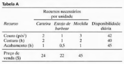

# Questão 1
A Gutchi Company fabrica carteiras, estojos de barbear e mochilas. A produção das peças
utiliza couro e materiais sint ́eticos, sendo o couro a matéria-prima que limita a produção. O
processo de produção requer dois tipos de mão-de-obra especializada: costura e acabamento.
A Tabela A dá a disponibilidade dos recursos, sua utilização nos três produtos e os lucros
por unidade.

  
  
  

**a)** Formule a questão como um problema de programação linear e ache a solução ́otima.

**b)** De acordo com a solução ́otima, determine o status de cada recurso.
